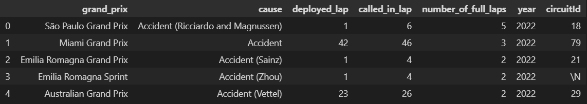

# ETL-Project

## Índice

1. [Descripción](#descripción)
2. [Extracción](#extracción)
3. [Transformación](#transformación)
4. [Carga](#carga)
5. [Conclusiones](#conclusiones)

<a name="descripción"/>

## Descripción

En el siguiente proyecto sobre el proceso ETL (Extract, Transform, Load), nos encargamos de extraer información desde varias fuentes de información distintas, acomodar y limpiar dicha información y, por último, almacenar esa información.

## Objetivo principal

El proyecto se divide en varias fases:

 <a name="extracción"/>

### Extracción

En la fase de extracción nos dedicamos a buscar información acerca de los diferentes circuitos a lo largo de la historia en la formula 1. Como referencia principal usamos un dataset de Kaggle, y para enriquecer nuestros datos, investigamos en otras webs datos que pudiesen complementar nuestro objetivo.

Como metodos de extracción, usamos en primer lugar, la descarga de los archivos csv en Kaggle, y por último, scrapeamos mediante selenium otras paginas web con la información que nos interesaba.

https://www.kaggle.com/

 

 

https://f1.fandom.com/wiki/Safety_Car

 

 

http://ergast.com/api/f1/drivers?=123

 

 <a name="transformación"/>
 
### Transformación

- En primer lugar descargamos los csv de la primera url, cambiamos los nombres de las columnas adaptándolas a nuestros objetivos, quitamos las columnas que no nos sirven para nuestra investigación y arreglamos los últimos detalles.

 

 
 

- En segundo lugar realizamos el web scraping en la segunda url sobre la tabla que nos interesa, nuevamente cambiamos los nombres de las columnas, creamos una nueva columna separando los años de los grand prix y arreglamos los últimos detalles.

 

 
 

- Y en tercer lugar sacamos la información de los pilotos mediante una API, una vez más cambiamos los nombres de las columnas, eliminamos columnas que no nos interesan y arreglamos los últimos detalles.

 

 
 

<a name="carga"/>

### Carga

Una vez tenemos los dataframes limpios, los guardamos como archivo csv y los introducimos en nuestro diagrama previamente hecho en MySQL.

 

<a name="conclusiones"/>

## Conclusiones

Este proyecto demuestra la importancia del proceso ETL en la gestión de datos, permitiendo la integración y transformación de información de diferentes fuentes para obtener datos más completos y precisos. Finalmente, se cargaron los datos en una base de datos relacional, lo que permite una gestión más eficiente de los mismos.